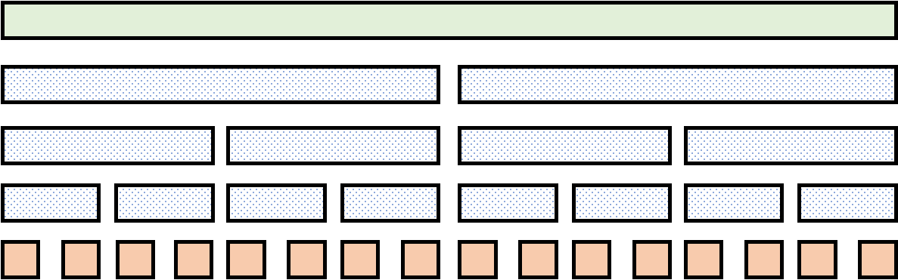

# 基础线段树小记

学了这么久线段树，来回忆一下线段树吧！也许你没有学过？那看完本篇定能有所收获。

*写在前面：因为是”基础线段树“，本篇的例题不会选的太难，都是比较板的题。*


## 初识线段树

### 线段树的一些基本性质

1. 普通线段树有 $O(n),\Theta(2n)$ 个节点，是一颗二叉树，如果除去深度最深的节点，是一颗满二叉树；
2. *线段树维护的信息应当是一个满足幺半群性质的信息*；
3. 线段树的每一个节点对应维护序列的一个区间。并且，一个节点 $[l,r]$ 的左儿子对应的节点是 $\big[l,\lfloor \frac {l+r}2 \rfloor\big]$，右儿子是 $\big(\lfloor \frac {l+r}2 \rfloor,r\big]$；
4. 线段树的节点的信息应当是两个儿子信息的并，以保证计算不重不漏（因此线段树维护的信息应当是可以合并的）；
5. 线段树可以将一个区间分成 $O(\log n)$ 个极大的节点（区间）；
6. 由性质 1 可以得到线段树的深度是 $O(\log n)$ 的。

### 线段树的两种图像理解表示

1. 线段式（绿色的是根，橙色的是叶子结点，第 $i$ 个叶子结点对应的是 $A_i$：

   

2. 有根树式 [^Note 1] ：

   

### 线段树的基本操作

通过线段树性质 1，我们通常采用二倍儿子表示法，即：若当前节点为 $i$，那么它的左儿子是 $2i$，右儿子是 $2i+1$。

*在下面的几个示例中，变量 $p$ 表示当前节点编号， $l$ 表示当前节点对应区间的左端点，$r$ 表示当前节点对应区间的右节点。*

#### 区间查询

线段树将一个区间分成 $O(\log n)$ 个节点。我们可以通过递归的方式找到对应的这些节点。

```cpp
/// @brief 示例：区间查询对应线段树节点
/// @param L 需要查询的范围左端点
/// @param R 需要查询的范围右端点 
void RangeQuery(int L,int R,int l,int r,int p) {
    //这一条保证了最多分成 O(log n) 个节点
    if(L<=l&&r<=R) {printf("Node number: %d\n",p); return ;}
    
    int mid=(l+r)>>1;
    if(L<=mid) RangeQuery(L,R,l,mid,p<<1);
    if(mid<R) RangeQuery(L,R,mid+1,r,p<<1|1);
}
```

#### 单点修改

线段树的一个叶子节点显然直接对应的原序列中的元素，而它的深度是 $O(\log n)$ 的。因此可以直接修改叶子结点自下而上统计信息。

通常我们会写一个 `PushUp` 函数，来接收更新元素信息，也就是接受两个儿子的并：

```cpp
/// @brief 示例：维护区间和
void PushUp(int p) {
    nodes_[p].data=nodes_[p<<1].data+nodes_[p<<1|1].data;
}
```

然后也是通过递归的方式来找到对应叶子节点：

```cpp
/// @brief 示例：单点增加
/// @param X 元素在序列的位置（下标）
/// @param delta 元素增加的值
void NodeAdd(int X,int delta,int l,int r,int p) {
	if(l==r) {nodes_[p].data+=delta; return ;}
    int mid=(l+r)>>1;
    if(X<=mid) NodeAdd(X,delta,l,mid,p<<1);
    else NodeAdd(X,delta,mid+1,r,p<<1|1);
    PushUp(p);
}
```

所有的线段树都支持单点修改（某种意义上可持久化线段树也算“修改”）。

#### 区间修改

我们发现直接区间修改并不能保证良好的复杂度。因此我们引入**懒标记**。懒标记维护这个节点**整个子树都满足的性质**。

+ 性质：假设一个节点有懒标记，那么它的懒标记一定比存在懒标记的祖先的懒标记获得时间更早。

通常我们会写一个 `PushDown` 函数来下传懒标记。（注意懒标记在区间修改、区间查询、单点修改都应该下传，否则得到的值不是真实的。）

```cpp
/// @brief 示例：区间增加的 push down
/// @note l,r 并不一定要有，只是这个示例需要。
void PushDown(int p,int l,int r) {
    int &tag=nodes_[p].add_lazy_tag;
    int mid=(l+r)>>1;
    nodes_[p<<1].add_lazy_tag+=tag;
    nodes_[p<<1].data+=tag*(mid-l+1);
    nodes_[p<<1|1].add_lazy_tag+=tag;
    nodes_[p<<1|1].data+=tag*(r-mid);
    tag=0;
}
```

然后通常也是通过递归修改：

```cpp
/**
 * @brief 示例：区间加操作
 * 
 * @param L 需要修改的范围左端点
 * @param R 需要修改的范围右端点 
 * @param delta 增量
 */
void RangeAdd(int L,int R,int delta,int l,int r,int p) {
	if(L<=l&&r<=R) {
        nodes_[p].data+=(r-l+1)*delta;
        nodes_[p].add_lazy_tag+=delta;
        return ;
    }
    PushDown(p,l,r); //注意 push down！
    int mid=(l+r)>>1;
    if(L<=mid) RangeAdd(L,R,delta,l,mid,p<<1);
    if(mid<R) RangeAdd(L,R,delta,mid+1,r,p<<1|1);
    PushUp(p);
}
```

#### 建树

对于某些信息，我们不一定需要初始建树；有些则一定要。自底向上建树，复杂度 $O(n)$。

```cpp
/// @brief 示例：区间加法的建树
/// @param init_array_ 初始的序列
void TreeInitialConstruct(int *init_array_,int l,int r,int p) {
    if(l==r) {nodes_[p].data=init_array_[l]; return ;}
    int mid=(l+r)>>1;
    TreeInitialConstruct(init_array_,l,mid,p<<1);
    TreeInitialConstruct(init_array_,mid+1,r,p<<1|1);
    PushUp(p);
}
```


#### 练手题：[P3372 【模板】线段树 1](https://www.luogu.com.cn/problem/P3372)

> 区间加，查询区间和。

你完全可以参考上面的示例来实现它。

[Code](../BlogCodeSource/SegmentTree-Review/P3372.cpp)[^Doxygen]

这道题写了 Doxygen 注释，读起来应该很方便。  
如果对 C++ 语法熟悉的话，建议参考该代码的方式实现线段树，好写好调好用，效率也还行，尽管基本上拿不到最快解。  
如果不熟悉 C++ 语法，建议读懂实现思路就行，避免因为内存分配问题写炸调很久。


## 基础区间操作

#### 例题 1：[P1253 扶苏的问题](https://www.luogu.com.cn/problem/P1253)

> 区间赋值，区间加，查询区间最大值。

最基础的区间操作问题之一。可以考虑对赋值和加法都维护一个懒标记。当赋值存在的时候，加法就加在赋值标记上；当赋值的时候，清空加法标记。这样保证赋值的优先性，而不遗漏加法。

可以发现赋值操作的懒标记可以简化成一个 `bool` 类型，当为 `true` 的时候表示整个区间相等，此时区间最大值（节点维护的答案）也就是这个区间里面的数；当为 `false` 的时候，整个区间不保证完全相等。

[Code](../BlogCodeSource/SegmentTree-Review/P1253.cpp)[^Doxygen]

#### 例题 2：[P3373 【模板】线段树 2](https://www.luogu.com.cn/problem/P3373)

> 区间加，区间乘，查询区间和。

较基础的区间操作问题。发现最难的是区间修改，如何保证复杂度？当然是懒标记。

我们发现一个懒标记无法储存足够的信息，那么我们维护两个懒标记，分别维护常数项和未知数的系数。

也就是，因为我们不知道当前节点的子树内某一个节点的值是什么，不同子节点的值也不同，不妨设其为未知量 $x$。
那么我们对 $x$ 进行操作，得到 $((x\  {\rm op_1}\  v_1)\ {\rm op_2}\  v_2)\dots$。这个式子一定可以拆成为 $kx+b$ 的形式。因此我们一个懒标记维护 $k$，一个维护 $b$ 即可。浅浅探究一下可以得出，当做加法的时候，只有 $b$ 会改变（加法优先级低于乘法）；当乘法的时候，$k,b$ 都被乘了（乘法分配律）。

当 push down 懒标记的时候，下面的节点就会变为：$k_u\cdot(k_s x+b_s)+b_u=(k_u k_s) x+(b_u+k_u b_s)$，也即：$k_s\leftarrow k_s k_u,b_s\leftarrow b_u+k_u b_s$。（$u$ 是当前节点，$s$ 是 push down 的子节点）。

注意每次加法的时候，应该加 $x\cdot\text{(区间长度)}$。

这个过程很自然，就并不需要考虑什么顺序问题了。

[Code](../BlogCodeSource/SegmentTree-Review/P3373.cpp)


## 基础权值线段树与动态开点线段树

权值线段树是一种以值域为维护序列，每个点维护对应区间内有多少个原序列中的数。它和普通线段树的关系就好像桶和数组的关系一样。

通过权值线段树，我们可以快速统计给定**值域**区间 $[l,r]$，求出其中有多少个数。

通常权值线段树维护的值域很大，可以选择离散化。无法离散化的时候，可以选择动态开点。

动态开点线段树是指没用的点不开的线段树：我们发现就算值域 $V$ 很大，经过 $m$ 次操作以后，真正有贡献的节点只有 $O(m\log V)$ 个。

动态开点线段树的写法与之前的线段树有些不同，因为动态开点线段树不满足我们所说的*线段树性质 1*，便不能使用二倍儿子表示法。因此需要记它的左右儿子编号（如果存在的话）。通常我们这样写：

```cpp
struct node {
    int left_son,right_son;
    int cnt;
    ...
    node() {left_son=right_son=cnt=0;}
};
node nodes_[kSIZE]; //其实我的习惯是写指针然后 new 一个数组。
int nodes_pointer_; //这个在记得初始化为 0。
int NewNode() {return ++nodes_pointer_;}
```

之后要申请新节点就可以直接 `NewNode` 了，然后指定左右节点。递归的时候，直接写 `nodes_[p].left_son` 或 `nodes_[p].right_son` 即可，而不是 `p<<1` 或者 `p<<1|1` 了。

需要注意的是，动态开点线段树的操作细节和普通线段树略有不同：查询递归时遇到空节点就要返回；修改递归时遇到空节点要新建（记得把父节点的指针指向它）；push down 的时候，遇到空节点也应该新建节点，但不应该深入到更深层次。总之就是关于空节点的细节。


## 线段树上二分

**结合权值线段树**，通过线段树上二分，我们可以做到一些全局查询操作。它可以查询全局第 $k$ 大！

具体来说，设当前节点左儿子的对应区间的元素个数是 $cnt$（显然不存在左儿子时 $cnt=0$）。若 $k\leq cnt$ ，那么第 $k$ 大就位于左儿子所对应的区间，就是求左儿子对应区间的第 $k$ 大；反之，第 $k$ 大在右儿子，转化成求右儿子对应区间的第 $k-cnt$ 大这个子问题求解。

```cpp
/// @brief 查找当前区间第 k 大。
/// @note 如果是动态开点线段树，保持原样即可。如果是离散化后的普通权值线段树，那么
///       left_son 就是 p<<1，right_son 就是 p<<1|1。
int BinarySearch_kth_Element(int k,int l,int r,int p) {
    if(l==r) return l;
    int mid=(l+r)>>1,cnt_now=nodes_[nodes_[p].left_son].cnt;
    if(k<=cnt_now) 
        return BinarySearch_kth_Element(k,l,mid,nodes_[p].left_son);
    return BinarySearch_kth_Element(k-cnt_now,mid+1,r,nodes_[p].right_son);
}
```

类似于桶，普通权值线段树并不能求区间第 $k$ 大，而只能维护全局查询。但是结合可持久化线段树，就可以查询区间了。

#### 例题：[P3369 【模板】普通平衡树](https://www.luogu.com.cn/problem/P3369)

> 可以插入一个数、删除一个数；查询一个数的排名，查询排名为 $x$ 的数；查询一个数的前驱，查询一个数的后缀。

没错！~~没用的~~旋转 treap 可以被权值线段树所代替！把操作离线下来离散化。删除和加入就是单点加 1 和单点减 1，查询第 $k$ 大前面已经提到。查询某数排名，可以类似二分过程直接统计（如果往右儿子走答案加上左儿子的区间内元素数量，否则不变）。注意 $cnt$ 为 $0$ 的时候节点不存在不能往那个节点走。

查询前驱后继的做法，还是直接找。拿前驱举例：找到查询值对应链。如果不存在，找到出现不存在的那个点，然后一直尽量靠右儿子走即可；如果存在，找到最后一个分叉（也就是 $cnt$ 发生变化的一刻），同时链位于右儿子的点，先往左儿子走一步，然后尽量靠着右儿子走即可。

不过可以使用一个技巧：前驱就查询比 $x$ 排名小 $1$ 的数，后继就查询 $x+1$ 的排名对应的数。常数略微大一点。

这个做法常数、代码量之类的都很好，不过复杂度可能会被卡：

+ 如果问题不强制在线，离散化后，没必要动态开点，时间复杂度是 $O(m\log n)$ 的，空间复杂度是 $O(n)$ 的。
+ 如果问题强制在线，那么只能使用动态开点权值线段树，时间复杂度和空间复杂度都是 $O(m\log V)$。**这种复杂度比较高的，就会被卡**，参见 [P6136 【模板】普通平衡树（数据加强版）](https://www.luogu.com.cn/problem/P6136)。


## 拓展：线段树与线性变换

*前置知识：向量与矩阵乘法初步*

线段树维护的元素当然不限于数字！比如线性代数中最最常用的向量和矩阵。通过这两个东西，我们可以大幅减少问题的难度，简化运算，使运算更加程序化，有规律可寻。

### 区间矩阵乘法解决元素内部的元素相互影响的问题

通常线段树维护的元素是数值或者某个数值。但实际上线段树里面可以套数据结构，只要这个数据结构可以合并（上文提到的性质 4）。因此向量是线段树可以维护的一个东西。

它用来解决什么问题呢？大概是元素内部的元素还有互相影响的时候了！结合下面例题来看看吧：

#### 例题：[P7453 [THUSCH2017] 大魔法师](https://www.luogu.com.cn/problem/P7453)

> 给定一个序列，第 $i$ 个元素是一个三元组 $(A_i,B_i,C_i)$。有六种区间操作，分别是：（$v$ 是一个指定的整数）
>
> 1. $A_i\leftarrow A_i+B_i$,
> 2. $B_i\leftarrow B_i+C_i$,
> 3. $C_i\leftarrow C_i+A_i$,
> 4. $A_i\leftarrow A_i+v$,
> 5. $B_i\leftarrow vB_i$,
> 6. $C_i\leftarrow v$. 
>
> 另外，还会查询区间 $i\in[l,r]$ 的 $A_i$ 之和，$B_i$ 之和以及 $C_i$ 之和。

我们发现普通的线段树很难维护这种元素内部互相影响，但元素间独立的问题。但是我们可以联想到，我们学过哪种变换能让元素内部互相影响呢？矩阵乘法！当向量乘以一个矩阵的时候，向量内的每一个坐标都是互相有影响的。

再看看这个形式，如果把三元组看做一个向量，那这些操作不都是它乘以一个矩阵嘛！

也许你会问常数怎么办？这有一个套路：再设立一个常数项，初始第 $i$ 个向量就长这样：$
\begin{bmatrix}
A_i\\B_i\\C_i\\1
\end{bmatrix}
$。那么常数始终放第 4 列就可以了。

那么变换的矩阵长什么样呢？其实自己推一推就可以了。这里拿操作 1,4,6 举例：

1. $
   \begin{bmatrix}
   1&1&0&0\\
   0&1&0&0\\
   0&0&1&0\\
   0&0&0&1
   \end{bmatrix}
   $
2. $
   \begin{bmatrix}
   1&0&0&v\\
   0&1&0&0\\
   0&0&1&0\\
   0&0&0&1
   \end{bmatrix}
   $
3. $
   \begin{bmatrix}
   1&0&0&0\\
   0&1&0&0\\
   0&0&0&v\\
   0&0&0&1
   \end{bmatrix}
   $

（注意这个矩阵是按照列变换推的，要注意一下遍历顺序。）

通过以上推导我们简单地解决了这道题，而不用繁杂地分类讨论了。同时我们也能发现，操作必须是线性变换才行！即运算得是线性的（数乘和加法），而不能是形如 $A_i\leftarrow A_i\cdot B_i$ 这种。

[Code 1](../BlogCodeSource/SegmentTree-Review/P7453-Easy.cpp)[^Doxygen][^中二病！]

[Code 2](../BlogCodeSource/SegmentTree-Review/P7453-Fast.cpp)（矩阵展开优化，但没优化多少）。

### 动态 DP (DDP) 结合线段树
既然线段树可以维护向量操作，线段树当然也可以维护矩阵乘法！不只是普通矩乘，广义的都可以。

比如我们把普通矩阵乘法的“乘”定义成加法，“加”定义成 $\max$ 操作，就是可以的：
$$
(A*B)_{i,j}=\bigoplus_{k=1}^n {A_{i,k}\otimes B_{k,j}}\Longrightarrow (A*B)_{i,j}=\max_{k\in[1,n]}\{{A_{i,k}+B_{k,j}}\}
$$

DP 转移的本质是线性变换，也就是矩阵乘法。对于某些 DP，把 DP 初始状态写成一个向量，转移的过程写作一个矩阵，那么最终状态就是这个向量依次乘以各个矩阵。

举个例子：$dp_{i,0}=\max\{{dp_{i-1,0}+a_i,dp_{i-1,1}+b_i}\},dp_{i,1}=dp_{i-1,0}+c_i$ 这个 DP 式子，可以写作如下矩阵乘法（这里矩阵的“乘”定义成加法，“加”定义成 $\max$ 操作）：
$$
\begin{bmatrix}
dp_{i,0}\\
dp_{i,1}
\end{bmatrix}=
\begin{bmatrix}
a_i & b_i\\
c_i & -\infty
\end{bmatrix}
\begin{bmatrix}
dp_{i-1,0}\\
dp_{i-1,1}
\end{bmatrix}
$$
一个细节是 $dp_{i,1}=dp_{i-1,0}+c_i$ 这个式子应当改写成 $dp_{i,1}=\max{\{dp_{i-1,0}+c_i,dp_{i-1,1}+(-\infty)\}}$ 的形式满足矩阵乘法。

假如我们增加多次询问，每次询问修改 $a_i,b_i,c_i$ ，或查询最终状态（甚至一个 DP 的子问题的状态）怎么办？

显然可以直接暴力算，这样是平方级别的复杂度，不好。

但是由于矩阵的结合律，我们开一颗线段树，维护转移矩阵构成的序列。由于矩阵乘法有结合律，这样做是没有问题的。修改 $a_i$ 等，就是修改操作；查询状态，就是区间查询操作，最后乘上出始向量。

这样，问题的复杂度就降为了 $O(n\log n)$ 级别的了。

请注意，由于矩阵乘法没有交换律，线段树维护的矩阵必须**保证顺序**。

这就是 DDP 结合线段树。

请注意，**DDP 远不止这些，这仅仅是用线段树维护的部分**。DDP 是指动态初始状态，动态转移参数、次数的 DP。举个例子，线段树维护的是区间问题，我们还可以采用倍增预处理解决树上问题，比如 [P8820 [CSP-S 2022] 数据传输](https://www.luogu.com.cn/problem/P8820)。

同时你应当注意到，***动态 DP 结合线段树*** 和 ***区间矩阵乘法解决元素间相互影响的问题*** 的一个明显的区别是前者线段树维护的元素就是矩阵，求的就是区间矩阵的积；后者线段树维护的元素是向量，求的是区间向量的和（包括但不限于和），矩阵乘法只是区间操作。

#### 例题：[CF1814E Chain Chips](https://codeforces.com/problemset/problem/1814/E)

> 给定一条链，边有边权 $a_i$，点按 1~n 顺序给出；初始每个点 $i$ 上有一个编号为 $p_i=i$ 的芯片，可以移到任意一个位置，代价为经过的边权和。求让芯片编号为错排（即 $\forall i,p_i\neq i$）的最小代价。过程中允许芯片重合，但在结束时不允许。
>
> 给定 $Q$ 次询问，每次给定 $i,x$，修改 $a_i$ 的值为 $x$。每次修改后输出最小代价。

显然一条边一定会被经过偶数次。并且，第一条边和最后一条边必须被经过；不允许有连续两个边不被经过，否则中间的点无法形成错排。满足这些条件的选边方案被称为**合法**的。

设所有的边权和为 $s$，对于整个排列，我们一定能保证用 $2s$ 的代价把它变成错排（每个往后移一位，最后一个移到首部）。由于排列的子序列仍然是排列，对于一个长度大于 1 的子串（一段连续的点），若它们的边权和为 $t$，那么我们也能保证用 $2t$ 的代价把它变成错排。

因此我们考虑**选若干段连续的边经过两次，并且每段之间空一个边不经过**，就可以得到更少的代价。并且可以看出，**这种方法涵盖了所有合法的经过的边的选择情况**。任何一种合法选边方案，都可以优化成这类方案。举个例子：$[2,0,2,4,4,2,0,2]$ 可以优化成 $[2,0,2,2,2,2,0,2]$。因此最优方案一定在这类方案构成的集合中。

这下我们就可以写出 DP 式子了：$dp_{i,0}$ 表示考虑前 $i$ 条边，第 $i$ 条边不选择经过的的最小代价，$dp_{i,1}$ 表示考虑前 $i$ 条边，第 $i$ 条边选择经过的代价。那么：
$$
dp_{i,0}=dp_{i-1,1},dp_{i,1}=\max\{{dp_{i-1,0},dp_{i-1,1}}\}+2\cdot a_i
$$
***练习**：仿照上文的举例写出 DP 转移的矩阵乘法形式。*

得到 DP 式之后，发现 DP 转移的矩阵构成一个序列，因此可以用线段树维护矩阵乘法。修改 $a_i$，就是把矩阵含有 $a_i$ 的部分修改，对应线段树上的单点修改。比较方便的是，这个问题是全局查询的，因此查询的时候返回根节点的值即可。

可以发现，DDP 的难点并不在用线段树维护，而还是在得出 DP 转移形式。线段树仅仅是一种维护方式罢了。

[Code](../BlogCodeSource/SegmentTree-Review/CF1814E.cpp)[^Note 2]


***

[^Note 1]: 转载自 https://hylwxqwq.github.io 洛谷 @black_trees

[^Doxygen]: 采用了 Doxygen 注释
[^Note 2]: 作者早期码风
[^中二病！]: 作者发巅